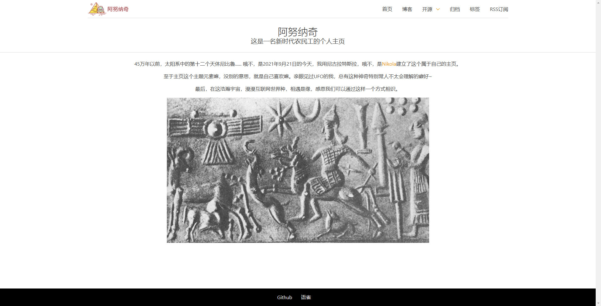
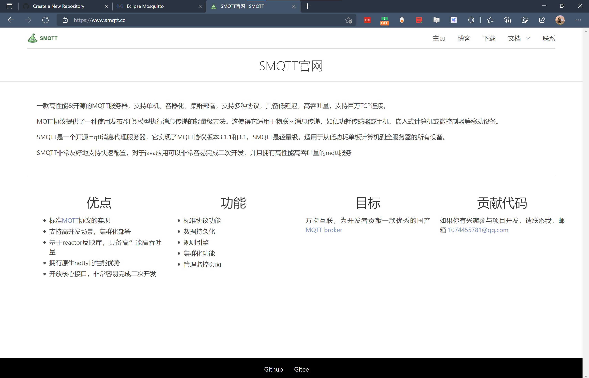

> 本博客样式修改自网站 https://mosquitto.org/ 的网站代码

## 用途

本项目适合使用Python栈的同学建立个人博客，或作为产品主页使用。

## 样式

## 使用文档

https://getnikola.com/#

## 安装构建

### install Nikola

https://getnikola.com/getting-started.html#install

### build

excute `nikola build` and checkout the output directory.

## github 自动构建

https://getnikola.com/blog/automating-nikola-rebuilds-with-github-actions.html

## CNAME 

需修改 files/CNAME 文件内容为你自己的域名

## ShowCase
### smqtt
主页：https://www.smqtt.cc/

代码库：https://github.com/tangyiming/smqtt-site/tree/src

